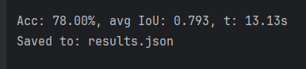
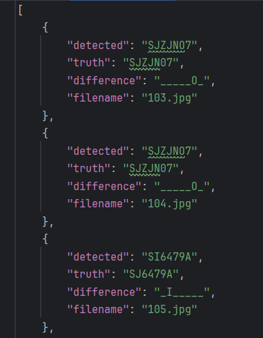

# Polish plate number recognition

Excerpt from a small uni project (thus no commit history).

Program detects licence plates from photos and reads their numbers. 
It uses fine-tuned YOLO model for detection and pytesseract OCR to read numbers. 

To run: `python main.py`

##### Tesseract lang info

During testing, a custom PyTesseract lang was made using first 60 imgs from [this dataset](https://www.kaggle.com/datasets/piotrstefaskiue/poland-vehicle-license-plate-dataset).
The rest was used for testing. 
However, this public repo uses default 'eng' lang instead, due to licence limitations.
I highly recommend training your own tesseract lang as it can vastly improve OCR's accuracy.

### Example output for 100 photos

### Setup

- Packages:
`pip install -r requirements.txt --upgrade`

- Install [tesseract-ocr](https://github.com/tesseract-ocr/tesseract?tab=readme-ov-file#installing-tesseract) 
and change path at the beginning of `main.py`

- If you want to test this, download [this dataset](https://www.kaggle.com/datasets/piotrstefaskiue/poland-vehicle-license-plate-dataset)
and put `photos` and `annotations.xml` in a new `data/` dir. Alternatively put your own dataset there.

- (Optional) Move your tesseract lang file to `your_tesseract_installation_dir/Tesseract-OCR/tessdata/`
Optional setup for detection using nvidia gpu's instead of cpu:

- PyTorch uninstallation for correct CUDA version:
`pip uninstall torch torchvision torchaudio`

- Change URL to match your CUDA version: 
`pip3 install torch torchvision torchaudio --index-url https://download.pytorch.org/whl/cu126`

### Detection model

If you want to use your own detection model, look at `models/` directory.
I used this fine-tuned model: [license-plate-finetune-v1x.pt](https://huggingface.co/morsetechlab/yolov11-license-plate-detection/tree/main)
(model licence info in the project's description).

### License

- [AGPLv3](https://www.gnu.org/licenses/agpl-3.0.en.html)